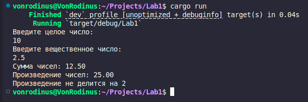

# Отчёт по лабораторной работе №1

## Цель работы:
Закрепление навыков работы с основными элементами языка программирования Rust, включая ввод данных, преобразование типов, выполнение арифметических операций и использование условных конструкций.

---

## Задание:
1. Организовать ввод данных от пользователя:
    - целого числа
    - вещественного числа
2. Преобразовать введённые строки в соответствующие числовые типы (i32 и f64).
3. Вычислить:
    - сумму введённых чисел;
    - произведение введённых чисел.
4. Проверить, делится ли округлённое до ближайшего целого произведение чисел на 2, и вывести результат проверки.
5. Организовать форматированный вывод результатов вычислений с точностью до двух знаков после запятой.

---

## Код программы:
```rust
use std::io;

fn main() {
    println!("Введите целое число: ");
    let mut int_input = String::new();
    io::stdin().read_line(&mut int_input).expect("Ошибка ввода");
    let int_number: i32 = int_input.trim().parse().expect("Не удалось преобразовать в целое число");

    println!("Введите вещественное число: ");
    let mut float_input = String::new();
    io::stdin().read_line(&mut float_input).expect("Ошибка ввода");
    let float_number: f64 = float_input.trim().parse().expect("Не удалось преобразовать в вещественное число");

    let sum = int_number as f64 + float_number;
    let product = int_number as f64 * float_number;

    println!("Сумма чисел: {:.2}", sum);
    println!("Произведение чисел: {:.2}", product);

    if (product.round() as i32) % 2 == 0 {
        println!("Произведение делится на 2");
    } else {
        println!("Произведение не делится на 2");
    }
}
```

## Пример выполнения программы:

---

## Вывод:
В ходе выполнения лабораторной работы были изучены основные операции ввода, вывода и преобразования данных в языке Rust. Программа демонстрирует базовые принципы работы с типами данных, арифметическими операциями и условными конструкциями. Полученные навыки являются основой для создания более сложных программ.
