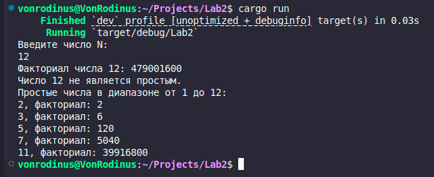

# Отчёт по лабораторной работе №2

## Цель работы:
Разработка программы на языке Rust, демонстрирующей использование функций, циклов и управляющих конструкций для выполнения следующих математических операций:
1. Вычисление факториала числа.
2. Проверка числа на простоту.
3. Нахождение всех простых чисел в заданном диапазоне.

---

## Задание:
1. Запросить у пользователя целое число.
2. Реализовать функцию для вычисления факториала числа.
3. Реализовать функцию для проверки числа на простоту.
4. Найти все простые числа в диапазоне от 1 до введённого числа, используя функцию проверки простоты числа.
5. Для каждого найденного простого числа вычислить его факториал и вывести результат.

---

## Код программы:
```rust
use std::io;

// Функция для вычисления факториала числа
fn factorial(num: u32) -> u64 {
    let mut result: u64 = 1;
    for i in 1..=num {
        result *= i as u64;
    }
    result
}

// Функция для проверки числа на простоту
fn is_prime(num: u32) -> bool {
    if num < 2 {
        return false;
    }
    for i in 2..=((num as f64).sqrt() as u32) {
        if num % i == 0 {
            return false;
        }
    }
    true
}

// Основная функция программы
fn main() {
    // Запрос у пользователя числа n
    println!("Введите число N: ");
    let mut input = String::new();
    io::stdin().read_line(&mut input).expect("Ошибка ввода");
    let n: u32 = input.trim().parse().expect("Не удалось преобразовать в число");

    // Нахождение факториала числа n
    let factorial_n = factorial(n);
    println!("Факториал числа {}: {}", n, factorial_n);

    // Проверка числа n на простоту
    if is_prime(n) {
        println!("Число {} является простым.", n);
    } else {
        println!("Число {} не является простым.", n);
    }

    // Нахождение всех простых чисел в диапазоне от 1 до n
    println!("Простые числа в диапазоне от 1 до {}:", n);
    for i in 1..=n {
        if is_prime(i) {
            let fact = factorial(i);
            println!("{}, факториал: {}", i, fact);
        }
    }
}
```

## Пример выполнения программы

---

## Вывод:
В результате выполнения лабораторной работы была создана программа, демонстрирующая использование функций, циклов и условных конструкций в языке Rust. Программа позволяет автоматизировать вычисление факториалов, проверку чисел на простоту и нахождение простых чисел в диапазоне. Полученные навыки являются важными для написания более сложных приложений, использующих базовые алгоритмы обработки данных.
