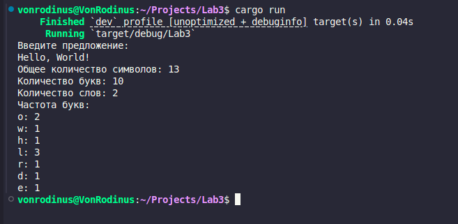

# Отчёт по лабораторной работе №3

## Цель работы:
Написать программу для обработки текста, подсчёта количества слов, букв и символов в предложении, а также анализа частоты появления каждой буквы.

---

## Задание:
1. Запросить у пользователя текстовое предложение (строку).
2. Подсчитать общее количество символов в предложении, включая пробелы и знаки пунктуации.
3. Подсчитать количество букв, игнорируя пробелы и знаки пунктуации.
4. Разделить строку на слова и определить их количество.
5. Проанализировать частоту появления каждой буквы (регистр игнорируется).

---

## Код программы:
```rust
use std::collections::HashMap;
use std::io;

fn main() {
    // Запрашиваем предложение у пользователя
    println!("Введите предложение: ");
    let mut input = String::new();
    io::stdin().read_line(&mut input).expect("Ошибка ввода");
    let sentence = input.trim();

    // Выводим общее количество символов (включая пробелы и знаки препинания)
    let total_chars = sentence.chars().count();
    println!("Общее количество символов: {}", total_chars);

    // Подсчитываем количество букв (игнорируя пробелы и знаки пунктуации)
    let letters_only: String = sentence.chars().filter(|c| c.is_alphabetic()).collect();
    let total_letters = letters_only.chars().count();
    println!("Количество букв: {}", total_letters);

    // Подсчитываем количество слов
    let words: Vec<&str> = sentence.split_whitespace().collect();
    let word_count = words.len();
    println!("Количество слов: {}", word_count);

    // Подсчитываем частоту появления каждой буквы
    let mut letter_frequency: HashMap<char, usize> = HashMap::new();
    for letter in letters_only.to_lowercase().chars() {
        let counter = letter_frequency.entry(letter).or_insert(0);
        *counter += 1;
    }

    println!("Частота букв:");
    for (letter, count) in letter_frequency {
        println!("{}: {}", letter, count);
    }
}
```

## Пример выполнения программы

---

## Вывод:
В процессе выполнения лабораторной работы была создана программа, обрабатывающая текстовые данные. Программа демонстрирует применение основных конструкций языка Rust, таких как работа со строками, фильтрация данных, использование коллекций (HashMap) и методов обработки текста. Это позволяет эффективно решать задачи текстового анализа, что может быть полезно в более сложных приложениях.
