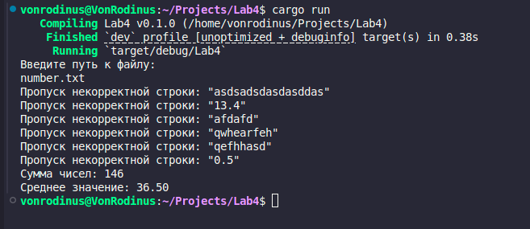
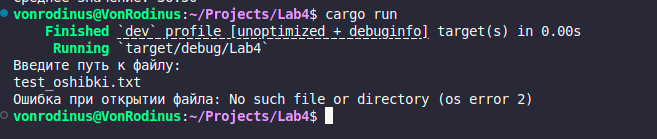

# Отчёт по лабораторной работе №4

## Цель работы
Изучить обработку ошибок в языке программирования Rust через реализацию программы, считывающей целые числа из файла, вычисляющей их сумму и среднее значение.

## Задание
    1. Запросить у пользователя путь к файлу, содержащему список чисел (одно число на строке).
    2. Прочитать содержимое файла, обработав возможные ошибки:
        ◦ Отсутствие файла.
        ◦ Ошибки при чтении строк.
        ◦ Наличие некорректных данных в файле.
    3. Игнорировать строки, которые не удаётся преобразовать в целые числа.
    4. Вычислить сумму и среднее значение корректных чисел.
    5. Корректно обработать ситуации, когда:
        ◦ Файл пуст.
        ◦ В файле отсутствуют корректные числа.

## Код программы
```rust
use std::fs::File;
use std::io::{self, BufRead};

fn main() {
    // Запрашиваем путь к файлу у пользователя
    println!("Введите путь к файлу: ");
    let mut file_path = String::new();
    io::stdin().read_line(&mut file_path).expect("Ошибка ввода");
    let file_path = file_path.trim();

    // Попытка открыть файл
    let file = File::open(&file_path);
    let file = match file {
        Ok(f) => f,
        Err(e) => {
            println!("Ошибка при открытии файла: {}", e);
            return;
        }
    };

    // Чтение файла построчно
    let reader = io::BufReader::new(file);
    let mut sum = 0;
    let mut count = 0;

    for line in reader.lines() {
        match line {
            Ok(line_content) => {
                // Пробуем конвертировать строку в число
                match line_content.trim().parse::<i32>() {
                    Ok(num) => {
                        sum += num;
                        count += 1;
                    }
                    Err(_) => {
                        println!("Пропуск некорректной строки: \"{}\"", line_content);
                    }
                }
            }
            Err(e) => {
                println!("Ошибка при чтении строки: {}", e);
                return;
            }
        }
    }

    // Выводим результаты или сообщение о пустом файле
    if count > 0 {
        let average = sum as f64 / count as f64;
        println!("Сумма чисел: {}", sum);
        println!("Среднее значение: {:.2}", average);
    } else {
        println!("В файле нет корректных чисел.");
    }
}
```

## Пример выполнения программы



## Вывод
В ходе выполнения лабораторной работы был изучен механизм обработки ошибок в Rust. Программа успешно решает поставленные задачи, демонстрируя:
    1. Обработку ошибок при открытии и чтении файла.
    2. Игнорирование некорректных данных.
    3. Вычисление суммы и среднего значения чисел из файла.
