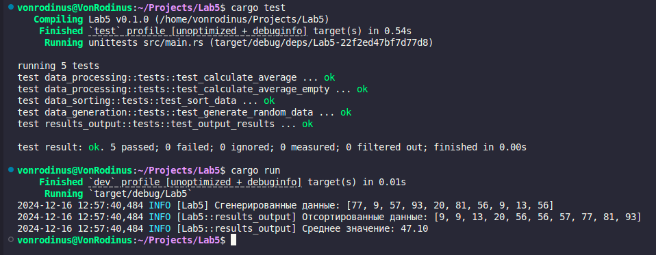

# Отчёт по лабораторной работе №5

## Цель работы
Создать проект с использованием нескольких модулей и внешних библиотек, реализовать автоматическое тестирование функций, а также организовать логирование на каждом этапе работы программы.

## Задание
    1. Генерация данных: Создание случайного массива целых чисел с заданными параметрами.
    2. Сортировка данных: Упорядочивание элементов массива по возрастанию.
    3. Обработка данных: Вычисление среднего значения элементов массива.
    4. Вывод результатов: Отображение отсортированных данных и среднего значения.
    5. Автоматическое тестирование: Проверка корректности работы каждой функциональности с использованием тестов.

## Код программы
```rust
//data_generation.rs
use rand::Rng;

/// Функция генерации случайных чисел.
/// Принимает количество элементов и максимальное значение.
pub fn generate_random_data(count: usize, max_value: i32) -> Vec<i32> {
    let mut rng = rand::thread_rng();
    (0..count).map(|_| rng.gen_range(0..max_value)).collect()
}

#[cfg(test)]
mod tests {
    use super::*;

    #[test]
    fn test_generate_random_data() {
        let data = generate_random_data(10, 50);
        assert_eq!(data.len(), 10);
        assert!(data.iter().all(|&x| x < 50));
    }
}

//data_processing.rs

/// Функция вычисления среднего значения.
/// Возвращает среднее значение или None, если массив пуст.
pub fn calculate_average(data: &[i32]) -> Option<f64> {
    if data.is_empty() {
        None
    } else {
        Some(data.iter().map(|&x| x as f64).sum::<f64>() / data.len() as f64)
    }
}

#[cfg(test)]
mod tests {
    use super::*;

    #[test]
    fn test_calculate_average() {
        let data = vec![1, 2, 3, 4, 5];
        let average = calculate_average(&data);
        assert_eq!(average, Some(3.0));
    }

    #[test]
    fn test_calculate_average_empty() {
        let data: Vec<i32> = vec![];
        let average = calculate_average(&data);
        assert_eq!(average, None);
    }
}

//data_sorting.rs

/// Функция сортировки данных.
/// Принимает вектор целых чисел и сортирует его по возрастанию.
pub fn sort_data(data: &mut [i32]) {
    data.sort_unstable();
}

mod tests {
    #[test]
    fn test_sort_data() {
        let mut data = vec![3, 1, 4, 1, 5, 9];
        super::sort_data(&mut data);
        assert_eq!(data, vec![1, 1, 3, 4, 5, 9]);
    }
}

//main.rs

mod data_generation;
mod data_sorting;
mod data_processing;
mod results_output;

use log::LevelFilter;
use simple_logger::SimpleLogger;

fn main() {
    // Инициализация логгера
    SimpleLogger::new().with_level(LevelFilter::Info).init().unwrap();

    // Генерация данных
    let mut data = data_generation::generate_random_data(10, 100);
    log::info!("Сгенерированные данные: {:?}", data);

    // Сортировка данных
    data_sorting::sort_data(&mut data);

    // Обработка данных
    let average = data_processing::calculate_average(&data);

    // Вывод результатов
    results_output::output_results(&data, average);
}

//results_output.rs
use log::info;

/// Функция вывода результатов.
pub fn output_results(data: &[i32], average: Option<f64>) {
    info!("Отсортированные данные: {:?}", data);
    match average {
        Some(avg) => info!("Среднее значение: {:.2}", avg),
        None => info!("Невозможно вычислить среднее значение: данные отсутствуют."),
    }
}

#[cfg(test)]
mod tests {
    use super::*;
    use log::LevelFilter;

    #[test]
    fn test_output_results() {
        // Инициализация логгера с использованием env_logger
        env_logger::builder()
            .filter_level(LevelFilter::Info)
            .is_test(true) // Настраиваем для использования в тестах
            .init();

        let data = vec![1, 2, 3, 4, 5];
        let average = Some(3.0);
        output_results(&data, average);
    }
}
```

## Пример выполнения программы


## Вывод
В ходе выполнения лабораторной работы была реализована программа с использованием нескольких модулей и внешних библиотек. Программа демонстрирует:
    1. Организацию структуры проекта на Rust.
    2. Использование автоматических тестов для проверки корректности функций.
    3. Применение внешних библиотек (rand, log, simple_logger) для расширения возможностей программы.
    4. Обработку ошибок, связанных с отсутствием данных или неверным вводом.